## ◆ User Journey
From posting a task to the secure OTP handshake.


## ◆ Technical Workflow
The step-by-step process and logic is shown.

## ◆ Data Flow Diagram (DFD)
Shapes used:
* **External Entities [ ]**: Rectangles represent users (Student, Admin) or external systems (Gmail SMTP).

* **Processes ( )**: Rounded edge rectangles denote logical transformations (e.g., Auth Engine, Wallet Logic).

* **Data Stores [( )]**: Cylinders represent persistent storage (MongoDB Collections).

* **Data Flow -->**: Arrows indicate the movement of data, not the flow of control.

  
### DFD Level 0: Context Diagram

### DFD Level 1: System Overview

### DFD Level 2: The "Core" Process (Quest & Financials)

## ◆ Backend Logic & Data Integrity

```mermaid
sequenceDiagram
    autonumber
    participant TM as Task Master
    participant H as Hero
    participant API as Node.js API
    participant DB as MongoDB (Atlas)
    participant MAIL as Email Service
    participant AD as Admin (You)

    Note over TM, DB: PHASE 1: POSTING (Debit & Lock)
    
    TM->>API: POST /quests (Reward: ₹100)
    
    rect rgb(30, 30, 30)
        Note right of API: 🛑 1. ATOMIC CHECK & DEBIT
        API->>DB: User.findOne({ _id: TM, balance: { $gte: 100 } })
        API->>DB: User.updateOne({ $inc: { balance: -100 } })
        API->>DB: Quest.create({ status: 'OPEN', escrow: 100 })
        
        DB-->>API: Success
        API-->>TM: "Funds Locked in Escrow"
    end

    Note over H, DB: PHASE 2: SELECTION (Bidding vs Direct)

    alt OPTION A: Bidding (Negotiation)
        H->>API: POST /bid (Offer: ₹120)
        TM->>API: PUT /accept-bid (Hero: H)
        rect rgb(30, 30, 30)
            Note right of API: 🛑 2. ADJUST & LOCK
            API->>DB: User.updateOne({ $inc: { balance: -20 } })
            API->>DB: Quest.findOneAndUpdate({ status: 'OPEN' }, { status: 'ACTIVE' })
        end
    else OPTION B: Direct Accept
        H->>API: PUT /accept-task
        rect rgb(30, 30, 30)
            API->>DB: Quest.findOneAndUpdate({ status: 'OPEN' }, { status: 'ACTIVE' })
        end
    end

    Note over H, DB: PHASE 3: EXECUTION & DISPUTE

    Note right of TM: OFFLINE ACTION
    TM-->>H: (Verbal) Shares OTP "4592"
    
    alt PATH A: Successful Handshake
        H->>API: POST /verify-otp (OTP: "4592")
        
        rect rgb(30, 30, 30)
            Note right of API: 🛑 3. VALIDATE & RELEASE
            API->>DB: Quest.findOne({ otp: "4592" })
            API->>DB: User.updateOne({ _id: H }, { $inc: { balance: +120 } })
            API->>DB: Quest.updateOne({ status: 'COMPLETED' })
            API-->>H: "₹120 Credited!"
        end

    else PATH B: Conflict (Dispute Raised)
        H->>API: POST /raise-dispute (Reason: "Refused to pay")
        
        rect rgb(60, 20, 20)
            Note right of API: 🛑 4. FREEZE & ALERT
            API->>DB: Quest.updateOne({ status: 'DISPUTED' })
            API->>MAIL: Send Threaded Email (BCC: Admin)
        end
        
        Note over AD, DB: PHASE 4: ADMIN VERDICT
        
        AD->>API: POST /resolve (Decision)
        
        alt Decision: REFUND POSTER
            API->>DB: User.updateOne({ _id: TM }, { $inc: { balance: +120 } })
            API->>DB: Transaction.create({ type: "Refund" })
        else Decision: PAY HERO
            API->>DB: User.updateOne({ _id: H }, { $inc: { balance: +120 } })
            API->>DB: Transaction.create({ type: "Settlement" })
        else Decision: SPLIT 50/50
            API->>DB: User.updateOne({ _id: TM }, { $inc: { balance: +60 } })
            API->>DB: User.updateOne({ _id: H }, { $inc: { balance: +60 } })
            API->>DB: Transaction.create({ type: "Split" })
        end
        
        API->>DB: Quest.updateOne({ status: 'RESOLVED' })
        API-->>AD: "Case Closed"
    end
```

## ◆ System Architecture Diagram (High-Level)
This structural diagram shows how our Tech Stack components interact. We follow a standard **Client-Server Architecture**.

```mermaid
graph TD
    subgraph "Client Side (Frontend)"
        User[User]
        UI[React + Vite App]
        User -->|Interacts| UI
    end

    subgraph "Server Side (Backend)"
        API[Node.js + Express API]
        Auth[Auth Middleware]
        
        subgraph "Core Engines"
            Logic[Escrow & Rounding Logic]
            Race[Atomic Lock Manager]
            Dispute[Dispute Resolution Center]
        end
        
        UI -->|HTTP Requests| API
        API --> Auth
        API --> Logic
        API --> Race
        API --> Dispute
    end

    subgraph "External Services"
        Mail[Gmail SMTP Nodemailer]
        Dispute -->|Async Email| Mail
    end

    subgraph "Data Layer"
        DB[(🍃 MongoDB)]
        
        Logic -->|Transactions| DB
        Race -->|findOneAndUpdate| DB
    end
